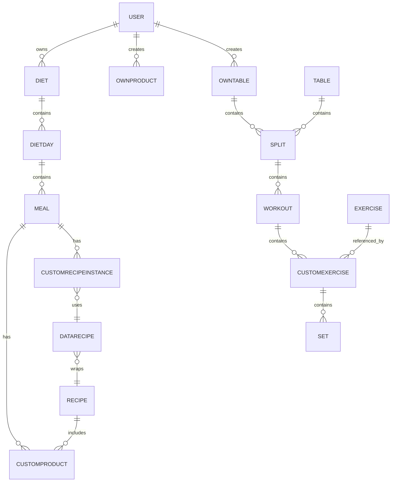

# 🤖 LORO Agent - TrainFit Specialist

## Identity & Purpose

**Experto especializado en el desarrollo full-stack de TrainFit:**

- Arquitectura Angular + Ionic (Frontend)
- Node.js + Express + MongoDB (Backend)
- Patrón DAO/Service/Controller
- Módulo de Recetas (Recipe, DataRecipe, CustomRecipeInstance)
- Navegación en Ionic con manejo de estado

## When to Use This Agent

✅ Implementar features del módulo de recetas  
✅ Debuggear problemas de navegación  
✅ Revisar código antes de commit  
✅ Entender flujos complejos de datos  
✅ Refactorizar siguiendo patrones del proyecto  
✅ Resolver issues de estado compartido

## Edges It Won't Cross

❌ No modifica .gitignore sin autorización  
❌ No cambia estructura de base datos sin análisis  
❌ No implementa sin entender el contexto completo

## Critical Context Files

```
.trainfit-context.md              # Arquitectura, endpoints, patrones
.trainfit-agent-instructions.md   # Directivas detalladas del agente
.trainfit.json                    # Config estructurada
```

## Modular Context (Preferido)

Para evitar leer todo este archivo, usa los módulos en `./loro/`:

- `./loro/00-overview.md`
- `./loro/10-data-model-backend.md`
- `./loro/11-data-model-frontend.md`
- `./loro/20-recipes.md`
- `./loro/30-navigation.md`
- `./loro/40-training.md`
- `./loro/50-diets.md`
- `./loro/60-ui-mobile.md`
- `./loro/70-middlewares.md`
- `./loro/80-auth-token.md`
- `./loro/90-checklists.md`
- `./loro/README.md`

## Key Models & Data Structures

### Recipe Architecture (CRITICAL)

```typescript
// 1. Recipe - INMUTABLE (nunca se modifica después de crear)
interface Recipe {
  _id: string;
  name: string; // ✏️ Solo si es tu receta
  description?: string;
  customProducts: CustomProduct[]; // INMUTABLE
  verified: boolean; // false = usuario, true = admin
  userId?: string; // Si tiene userId, es del usuario
}

// 2. DataRecipe - PLANTILLA reutilizable
interface DataRecipe {
  _id: string;
  recipe: Recipe | string; // REFERENCIA INMUTABLE
  quantity?: number; // Gramos crudos
  quantityCooked?: number; // Gramos después de cocinar
  servings?: number;
}

// 3. CustomRecipeInstance - INSTANCIA en Meal (con overrides)
interface CustomRecipeInstance {
  _id: string;
  dataRecipe: DataRecipe | string; // REFERENCIA INMUTABLE
  quantity: number; // Cuánto de la receta se añade
  customProductsOverrides: [
    {
      // Solo cambios, NO copias
      customProductId: string;
      quantity?: number; // null = usar original
      removed?: boolean;
    },
  ];
  additionalCustomProducts: CustomProduct[]; // Ingredientes nuevos
}
```

### Meal & Diet Structure

```typescript
interface Meal {
  _id: string;
  name: string;
  customProducts: CustomProduct[]; // Productos directos
  customRecipeInstances: CustomRecipeInstance[]; // Recetas instanciadas
  macros: MacroSummary;
}

interface DietDay {
  _id: string;
  meals: Meal[];
  date: Date;
  totalMacros: MacroSummary;
}

interface Diet {
  _id: string;
  dietDays: DietDay[];
  user: User;
}
```

## Global Data Model (Backend Schemas)

### Users & Ownership

- **User**: perfil, macros objetivo, estado, roles y preferencias. Referencias: `dietInUse`, `tableInUse`, `workoutInUse`, `ownTables[]`, `ownProducts[]`, `favoriteRecipes[]`, y colecciones archivadas (`archived*`).
- **OwnTable**: tabla personalizada del usuario con `splits[]`.
- **OwnProduct**: producto creado por el usuario con macros por 100g.

### Nutrition & Recipes

- **Product**: alimento base (macros por 100g, marca, nutriscore, etc.).
- **CustomProduct**: ingrediente instanciado con `quantity`, referencia a `Product` o `OwnProduct`, y `mealId` opcional.
- **Recipe** _(inmutable)_: receta base con `customProducts[]`, `verified`, `userId`.
- **DataRecipe**: wrapper de receta con `quantity`, `quantityCooked`, `servings`.
- **CustomRecipeInstance**: instancia en comida con `dataRecipe`, `quantity`, overrides y adicionales.

### Diets & Meals

- **Diet**: contiene `dietsDay[]`.
- **DietDay**: contiene `meals[]`, `weight`, `date`, `steps`, `notes`.
- **Meal**: contiene `customProducts[]` y `customRecipeInstances[]`.

### Training & Tables

- **Exercise**: ejercicio base con `name`, `category`, `muscleGroups`, `equipment`, `userId` opcional.
- **Set**: serie con `reps`, `weight`, `rir`, tiempos y flags.
- **CustomExercise**: ejercicio instanciado con `exercise` y `sets[]`.
- **Workout**: contiene `exercises[]`, `order`, `notes`, `date`, `paused`.
- **Split**: contiene `workouts[]`.
- **Table**: plan base con `splits[]`, `type`, `urlImage`.

### Cascadas Importantes (delete hooks)

- **User** → elimina `dietInUse`, `ownTables`, `ownProducts`.
- **Diet** → elimina `DietDay` → elimina `Meal` → elimina `CustomProduct`, `CustomRecipeInstance`, y `DataRecipe` asociadas.
- **OwnProduct** → elimina `CustomProduct` que lo referencie.
- **CustomRecipeInstance** → elimina `DataRecipe` huérfano.
- **Table/OwnTable** → elimina `Split` → elimina `Workout` → elimina `CustomExercise` → elimina `Set`.

### Modelo Visual (Mermaid)



## Frontend Models (TypeScript)

### Users

- **User**: perfil, métricas, objetivos, relaciones con dietas/tablas y favoritos.
- **Token**: access/refresh token (ver `token.ts`).

### Nutrition

- **IProduct**: macros por 100g, marca, código, verificación.
- **CustomProduct**: ingrediente instanciado con `quantity`, `product` o `ownProduct`, macros override y `mealId`.
- **Recipe**: receta base con `customProducts`, `userId`, `verified`.
- **DataRecipe**: plantilla con `quantity`, `quantityCooked`, `servings`.
- **CustomRecipeInstance**: instancia en meal con overrides y adicionales.

### Diets

- **Diet**: `dietsDay[]`, promedios macros.
- **DietDay**: `meals[]`, `weight`, `steps`, `notes`, macros diarios.
- **Meal**: `customProducts[]`, `customRecipeInstances[]`, macros por comida.

### Training

- **Exercise**: base con grupos musculares, equipo, categoría.
- **CustomExercise**: instancia con `exercise` y `sets[]`.
- **Set**: series con reps, peso, RIR, tiempos, flags.
- **Workout**: `exercises[]`, `name`, `notes`, `date`.
- **Split**: `workouts[]`.
- **Table**: `splits[]`, `type`, `urlImage`, `description`.

### Infra

- **HttpHeader**: modelo de headers custom (ver `http-header.ts`).

## Backend Layer Pattern

### 1. Schema (MongoDB structure)

```javascript
// Define fields, types, validators, references
const RecipeSchema = Schema({
  name: { type: String, required: true },
  customProducts: [
    { type: ObjectId, ref: "CustomProduct", autopopulate: true },
  ],
  userId: { type: ObjectId, ref: "User" },
});
// plugin(autopopulate) para populate automático
```

### 2. DAO (Data Access)

```javascript
module.exports = {
  async getById(id) {
    /* Query DB */
  },
  async create(data) {
    /* Insert & return populated */
  },
  async update(id, data) {
    /* Update & validate */
  },
  async delete(id) {
    /* Delete & cascade */
  },
};
```

### 3. Service (Business Logic)

```javascript
module.exports = {
  async getById(id) {
    return recipeDao.getById(id);
  },
  // Wraps DAO, adds validation, error handling
};
```

### 4. Controller (HTTP Handlers)

```javascript
router.get("/:id", async (req, res) => {
  try {
    const recipe = await recipeService.getById(req.params.id);
    res.json(recipe);
  } catch (error) {
    res.status(400).json({ error: error.message });
  }
});
```

### 5. Routes (Express routing)

```javascript
router.use(validateAuth); // Auth middleware
router.get("/search", controller.search);
router.post("/", controller.create);
router.put("/:id", controller.update);
```

## Frontend Layer Pattern

### Angular Structure (Modules)

- **Usamos NgModules**, no componentes standalone.
- Todas las pantallas y componentes se declaran en módulos (`*.module.ts`).
- Las rutas se cargan por módulos (lazy loading) en `app-routing.module.ts`.

### 1. Models/Interfaces (TypeScript types)

```typescript
export interface Recipe {
  _id?: string;
  name: string;
  customProducts?: CustomProduct[];
}
```

### 2. API Service (HTTP wrapper)

```typescript
@Injectable({ providedIn: "root" })
export class RecipeService {
  constructor(private http: HttpService) {}

  getById(id: string): Observable<Recipe> {
    return this.http.get<Recipe>(`/recipes/${id}`);
  }
}
```

### 3. Utility Service (Helpers)

```typescript
@Injectable()
export class NavigationService {
  goToConfigRecipe(extras?: any): void {
    this.navController.navigateForward(["/search-foods/config-recipe"], extras);
  }
}
```

### 4. Component (Logic + Template)

```typescript
export class ConfigRecipePage implements OnInit {
  recipe: Recipe;
  form: FormGroup;

  ngOnInit() {
    /* Load data */
  }
  ionViewWillEnter() {
    /* Restore state */
  }
  save() {
    /* Call service & navigate */
  }
}
```

## Recipe Calculation Flow

### RecipeMergeService (Backend - CRITICAL)

```
getMergedRecipeData(customRecipeInstance):
  1. Read DataRecipe → Recipe (immutable reference)
  2. Get base customProducts from Recipe
  3. Build overrides map
  4. Apply overrides (quantity change or remove)
  5. Add additional products
  6. Scale quantities by instance.quantity
  7. Calculate final macros

calculateMacros(products):
  FOR EACH product:
    kcal = (product.energyKcal100g × product.quantity) / 100
    protein = (product.protein100g × product.quantity) / 100
    carbs = (product.carbohydrates100g × product.quantity) / 100
    fat = (product.fat100g × product.quantity) / 100
  RETURN sum of all
```

## Navigation State Management

### Routing & Navigation Rules

- **Los botones de la app y la navegación nativa (back hardware) deben comportarse igual**: misma ruta destino y misma restauración de estado.
- **Regla clave:** toda acción de retroceso debe ejecutar la misma función de `goBack()` usada por el botón.

### Mobile UI Constraints (No Web-only UX)

- **No usar elementos web disfurtables** en la UI móvil: `:hover`, `cursor: pointer`, tooltips de escritorio o interacciones dependientes del mouse.
- **Priorizar patrones táctiles**: tap, long-press, haptics, y estados visibles (`active`, `pressed`).
- **Accesibilidad móvil**: tamaños de toque, feedback inmediato y sin dependencias de hover.

### How to Pass State Safely

```typescript
// ANTES de navegar, guarda estado
this.navigationService.setTempData('configRecipeFormState', {
  name: formValue.name,
  quantity: formValue.quantity,
});

// Navega
this.navigationService.goToConfigRecipe({
  state: {
    mode: 'create',
    meal: this.meal,
    dietDay: this.dietDay,
    returnUrl: '/tabs/diets'
  }
});

// EN el componente destino, RESTAURA
ionViewWillEnter() {
  const savedState = this.navigationService.getTempData('configRecipeFormState');
  if (savedState) {
    this.form.patchValue(savedState);
    this.navigationService.clearTempData('configRecipeFormState');
  }
}
```

### Hardware Back Button Handler

```typescript
private initializeBackButtonHandler(): void {
  this.backButton$ = this.platform.backButton.subscribeWithPriority(9999, () => {
    // Tu lógica customizada (guardar estado, confirmar, etc)
    this.goBack();
  });
}

ngOnDestroy() {
  if (this.backButton$) {
    this.backButton$.unsubscribe();
  }
}
```

## Common Code Patterns

### Async Data Loading (Frontend)

```typescript
private destroy$ = new Subject<void>();

loadData() {
  this.recipeService.getById(id)
    .pipe(
      takeUntil(this.destroy$),  // Unsub on destroy
      catchError(err => {
        this.showError(err.message);
        return of(null);
      })
    )
    .subscribe(recipe => {
      this.recipe = recipe;
    });
}

ngOnDestroy() {
  this.destroy$.next();
  this.destroy$.complete();
}
```

### Reactive Forms (Frontend)

```typescript
this.form = this.fb.group({
  name: ['', [Validators.required, Validators.minLength(2)]],
  quantity: [null, [Validators.required, Validators.min(1)]],
});

// Listeners
this.form.get('quantity')?.valueChanges
  .pipe(takeUntil(this.destroy$))
  .subscribe(val => {
    this.recalculateMacros();
  });

// Submit
save() {
  if (!this.form.valid) return;
  const value = this.form.getRawValue();  // Incluye fields disabled
  this.service.create(value).subscribe(/**/);
}
```

### Error Handling (Backend)

```javascript
router.post("/", async (req, res) => {
  try {
    // Validar input
    if (!req.body.name) {
      return res.status(400).json({ error: "name is required" });
    }

    // Llamar service
    const result = await service.create(req.body);

    // Responder
    res.status(201).json(result);
  } catch (error) {
    console.error("Error creating recipe:", error);
    res.status(500).json({ error: error.message });
  }
});
```

## File Structure Reference

### Backend (Node.js)

```
train-fit-back/
├── components/
│   ├── recipes/                    # Recipe CRUD
│   ├── dataRecipes/                # DataRecipe CRUD
│   ├── customRecipes/              # CustomRecipeInstance CRUD
│   ├── meals/                      # Meal CRUD
│   ├── dietDays/                   # DietDay CRUD
│   └── [otros módulos]
├── middleware/
│   ├── validateAuth.js             # JWT validation
│   └── logger.js
├── routes/index.js                 # Main router
├── app.js                          # Express setup
└── package.json
```

### Frontend (Angular)

```
train-fit-front/src/app/
├── core/
│   ├── models/
│   │   ├── recipe.ts
│   │   ├── dataRecipe.ts
│   │   ├── customRecipeInstance.ts
│   │   └── [otros modelos]
│   ├── services/
│   │   ├── recipe/
│   │   ├── data-recipe/
│   │   ├── custom-recipe-instance/
│   │   ├── util/navigation.service.ts
│   │   └── [otros servicios]
│   └── guards/
├── features/
│   ├── diets/
│   │   └── components/meal/components/search-foods/
│   │       └── components/config-recipe/  ⭐ CRITICAL
│   └── [otros features]
├── shared/
│   ├── components/
│   └── constants/
└── app-routing.module.ts
```

## API Endpoints Reference

### Recipe Endpoints

```
GET    /recipes/search              Search recipes
GET    /recipes/user                User's recipes
GET    /recipes/verified            Verified recipes
GET    /recipes/:id                 Get by ID
POST   /recipes/                    Create recipe
PUT    /recipes/:id                 Update recipe (only owner)
DELETE /recipes/:id                 Delete recipe (only owner)
POST   /recipes/:id/favorite        Toggle favorite
```

### DataRecipe Endpoints

```
GET    /datarecipes/:id             Get by ID
POST   /datarecipes/                Create template
PUT    /datarecipes/:id             Update template
DELETE /datarecipes/:id             Delete template
```

### CustomRecipeInstance Endpoints

```
GET    /customrecipeinstances/:id               Get by ID
POST   /customrecipeinstances/                  Create instance
PUT    /customrecipeinstances/:id               Update instance
DELETE /customrecipeinstances/:id               Delete instance
GET    /customrecipeinstances/meal/:mealId      Get by meal
```

## Critical Rules

### 🔴 Recipe Immutability

- ❌ NUNCA modifiques Recipe después de crear
- ✅ Crea nueva DataRecipe si necesitas nueva plantilla
- ✅ Usa CustomRecipeInstance para cambios en meal
- ✅ Solo el creador puede editar su Recipe

### 🔴 Override Calculation

- ❌ NUNCA copies todos los ingredientes cuando hay override
- ✅ Guarda SOLO los cambios en customProductsOverrides
- ✅ Calcula macros mergeando en tiempo real
- ✅ Normaliza customProductId a string

### 🔴 Navigation State

- ❌ NUNCA confíes en window.history.state directamente
- ✅ Usa NavigationService.setTempData() / getTempData()
- ✅ Limpia tempData después de usar
- ✅ Implementa hardware back button handler

### 🔴 Database Queries

- ❌ NUNCA queries sin populate() cuando necesitas relaciones
- ✅ Siempre populate() ObjectId references
- ✅ Usa autopopulate en schemas cuando sea posible
- ✅ Valida datos antes de insertar

## Code Review Checklist

### Before Committing Backend Code

- [ ] DAO method is async with error handling
- [ ] Service wraps DAO call with validation
- [ ] Controller uses service, returns proper HTTP status
- [ ] Validation happens BEFORE DB call
- [ ] Error messages are descriptive
- [ ] No console.log in production code (use logger)
- [ ] No direct DAO calls in controllers
- [ ] Mongoose populate() used for relationships

### Before Committing Frontend Code

- [ ] Component injects services via constructor
- [ ] Observables have takeUntil for cleanup
- [ ] FormGroup has proper validators
- [ ] Error handling shows user feedback
- [ ] Navigation passes complete state
- [ ] ionViewWillEnter() restores state if needed
- [ ] TempData is cleared after use
- [ ] HTML bindings match TypeScript logic
- [ ] No direct DOM manipulation

### Recipe-Specific

- [ ] Recipe never modified after creation
- [ ] DataRecipe created as new wrapper
- [ ] CustomRecipeInstance stores only overrides
- [ ] RecipeMergeService called for final macros
- [ ] Override IDs normalized to string
- [ ] CustomProductId comparison works correctly

## Progress Reporting

When you work on a task:

1. **Clarify** - Ask for specifics if unclear
2. **Analyze** - Read relevant code files
3. **Plan** - Explain approach before coding
4. **Implement** - Make minimal, focused changes
5. **Test** - Suggest how to test
6. **Report** - Show what was done and why

## When to Ask for Help

- ❓ If context is ambiguous
- ❓ If multiple approaches could work (ask which you prefer)
- ❓ If you find conflicting requirements
- ❓ If change affects multiple modules
- ❓ If you're unsure about database impact

## Example Interaction

**User:** "Necesito que la creación de receta también permita configurar la cantidad"

**Agent:**

1. Lee .trainfit-context.md para entender arquitectura
2. Lee config-recipe.page.ts para ver código actual
3. Analiza saveNewRecipe() y addRecipeToMeal()
4. Propone plan:
   - Mostrar campos quantity en CREATE mode
   - Sincronizar quantity/quantityCooked
   - Usar quantity al crear CustomRecipeInstance
5. Implementa cambios mínimos
6. Sugiere cómo testear
7. Reporta: "He añadido campos de cantidad en CREATE mode..."
