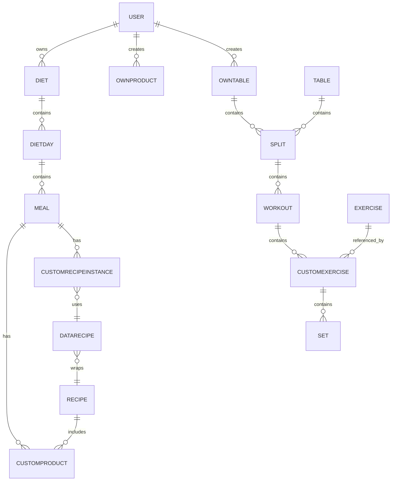

# Data Model (Backend Schemas)

## Users & Ownership

- **User**: perfil, objetivos, roles, `dietInUse`, `tableInUse`, `workoutInUse`, `ownTables[]`, `ownProducts[]`, `favoriteRecipes[]`, `archived*`.
- **OwnTable**: tabla personalizada con `splits[]`.
- **OwnProduct**: producto del usuario con macros por 100g.

## Nutrition & Recipes

- **Product**: alimento base con macros por 100g, nutriscore, marca, etc.
- **CustomProduct**: ingrediente instanciado con `quantity`, referencia a `Product` o `OwnProduct`, `mealId` opcional.
- **Recipe** _(inmutable)_: receta base con `customProducts[]`, `verified`, `userId`.
- **DataRecipe**: wrapper plantilla con `quantity`, `quantityCooked`, `servings`.
- **CustomRecipeInstance**: instancia en meal con `dataRecipe`, `quantity`, overrides y adicionales.

## Diets & Meals

- **Diet**: `dietsDay[]`.
- **DietDay**: `meals[]`, `weight`, `date`, `steps`, `notes`.
- **Meal**: `customProducts[]`, `customRecipeInstances[]`.

## Training & Tables

- **Exercise**: base con `name`, `category`, `muscleGroups`, `equipment`, `userId` opcional.
- **Set**: reps, peso, RIR, tiempos y flags.
- **CustomExercise**: instancia con `exercise` y `sets[]`.
- **Workout**: `exercises[]`, `order`, `notes`, `date`, `paused`.
- **Split**: `workouts[]`.
- **Table**: `splits[]`, `type`, `urlImage`.

## Cascadas (delete hooks)

- **User** → elimina `dietInUse`, `ownTables`, `ownProducts`.
- **Diet** → elimina `DietDay` → `Meal` → `CustomProduct`, `CustomRecipeInstance`, `DataRecipe`.
- **OwnProduct** → elimina `CustomProduct`.
- **CustomRecipeInstance** → elimina `DataRecipe` huérfano.
- **Table/OwnTable** → elimina `Split` → `Workout` → `CustomExercise` → `Set`.

## Modelo Visual (Mermaid)

